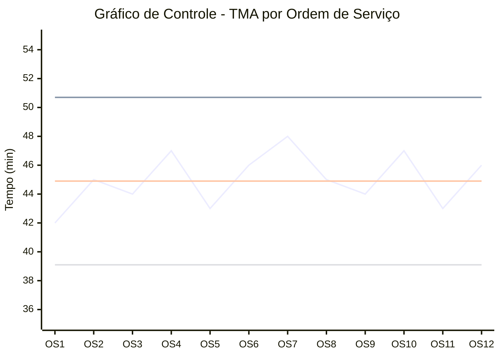

| OS | Valor Medido (min) | Média (CL) |  LSC |  LIC |
| -: | -----------------: | ---------: | ---: | ---: |
|  1 |                 42 |       44,9 | 50,7 | 39,1 |
|  2 |                 45 |       44,9 | 50,7 | 39,1 |
|  3 |                 44 |       44,9 | 50,7 | 39,1 |
|  4 |                 47 |       44,9 | 50,7 | 39,1 |
|  5 |                 43 |       44,9 | 50,7 | 39,1 |
|  6 |                 46 |       44,9 | 50,7 | 39,1 |
|  7 |                 48 |       44,9 | 50,7 | 39,1 |
|  8 |                 45 |       44,9 | 50,7 | 39,1 |
|  9 |                 44 |       44,9 | 50,7 | 39,1 |
| 10 |                 47 |       44,9 | 50,7 | 39,1 |
| 11 |                 43 |       44,9 | 50,7 | 39,1 |
| 12 |                 46 |       44,9 | 50,7 | 39,1 |

