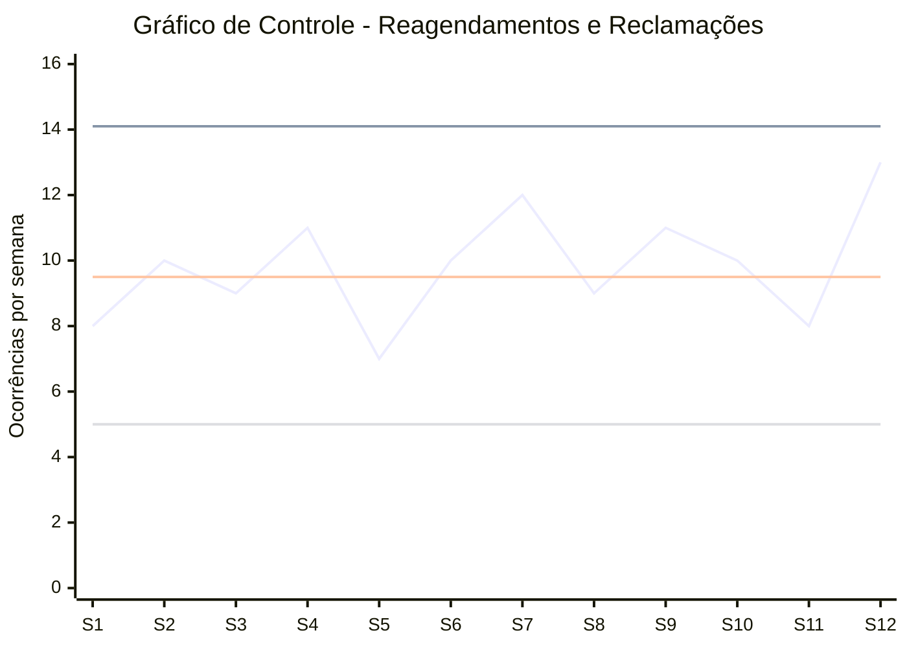

| Semana | Valor Medido | Média (CL) |  LSC | LIC |
| -----: | -----------: | ---------: | ---: | --: |
|      1 |            8 |        9,5 | 14,1 | 5,0 |
|      2 |           10 |        9,5 | 14,1 | 5,0 |
|      3 |            9 |        9,5 | 14,1 | 5,0 |
|      4 |           11 |        9,5 | 14,1 | 5,0 |
|      5 |            7 |        9,5 | 14,1 | 5,0 |
|      6 |           10 |        9,5 | 14,1 | 5,0 |
|      7 |           12 |        9,5 | 14,1 | 5,0 |
|      8 |            9 |        9,5 | 14,1 | 5,0 |
|      9 |           11 |        9,5 | 14,1 | 5,0 |
|     10 |           10 |        9,5 | 14,1 | 5,0 |
|     11 |            8 |        9,5 | 14,1 | 5,0 |
|     12 |           13 |        9,5 | 14,1 | 5,0 |

