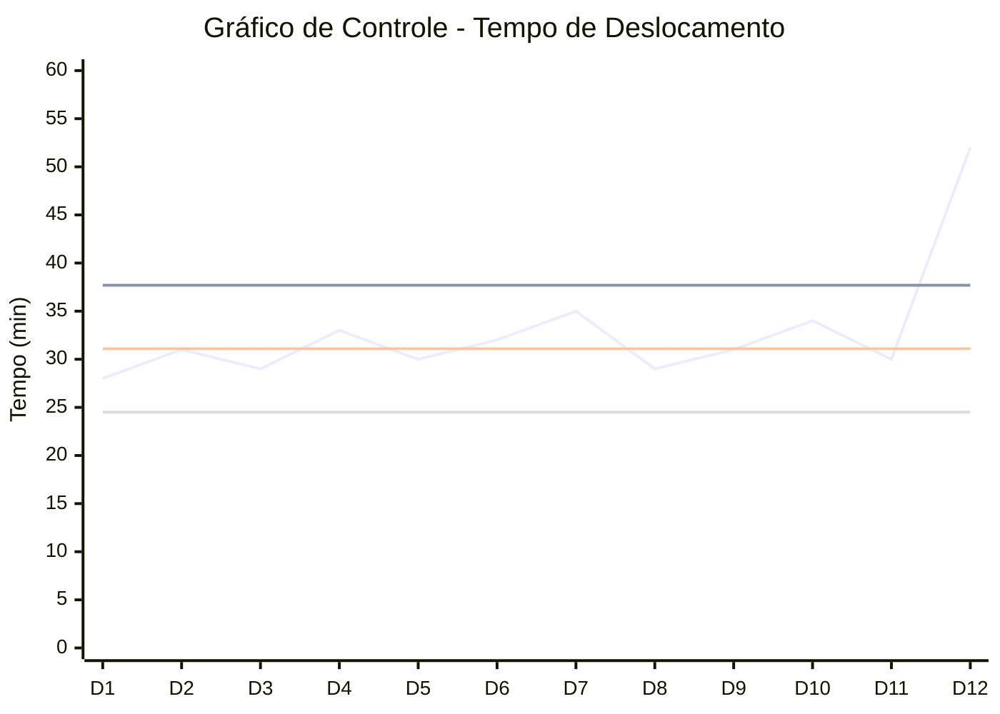

| Deslocamento | Valor Medido (min) | Média (CL) |  LSC |  LIC |
| -----------: | -----------------: | ---------: | ---: | ---: |
|            1 |                 28 |       31,1 | 37,7 | 24,5 |
|            2 |                 31 |       31,1 | 37,7 | 24,5 |
|            3 |                 29 |       31,1 | 37,7 | 24,5 |
|            4 |                 33 |       31,1 | 37,7 | 24,5 |
|            5 |                 30 |       31,1 | 37,7 | 24,5 |
|            6 |                 32 |       31,1 | 37,7 | 24,5 |
|            7 |                 35 |       31,1 | 37,7 | 24,5 |
|            8 |                 29 |       31,1 | 37,7 | 24,5 |
|            9 |                 31 |       31,1 | 37,7 | 24,5 |
|           10 |                 34 |       31,1 | 37,7 | 24,5 |
|           11 |                 30 |       31,1 | 37,7 | 24,5 |
|           12 |             **52** |       31,1 | 37,7 | 24,5 |

