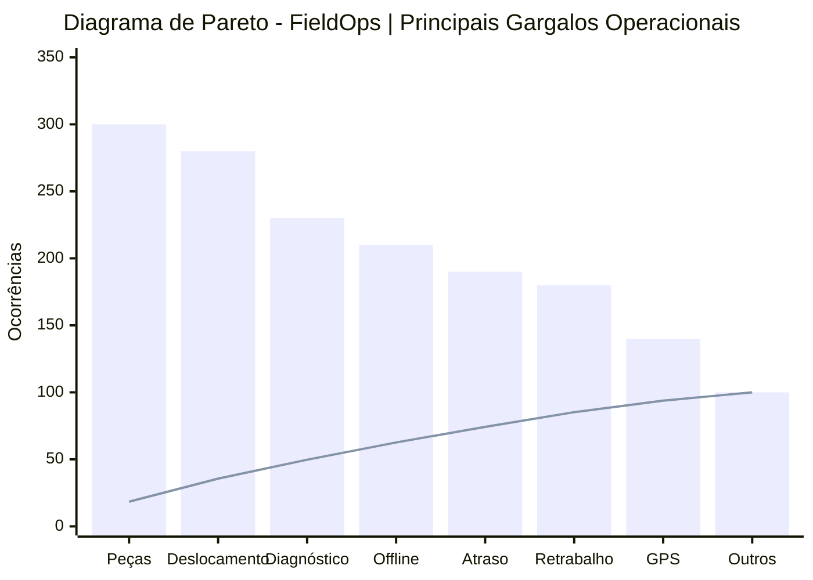

# Diagrama de Pareto - FieldOps | Principais Gargalos Operacionais

```mermaid
xychart-beta
    title "Diagrama de Pareto - FieldOps | Principais Gargalos Operacionais"
    x-axis ["Peças", "Deslocamento", "Diagnóstico", "Offline", "Atraso", "Retrabalho", "GPS", "Outros"]
    y-axis "Ocorrências" 0 --> 350
    bar [300, 280, 230, 210, 190, 180, 140, 100]
    line [18.4, 35.6, 49.7, 62.6, 74.2, 85.2, 93.8, 100]
```