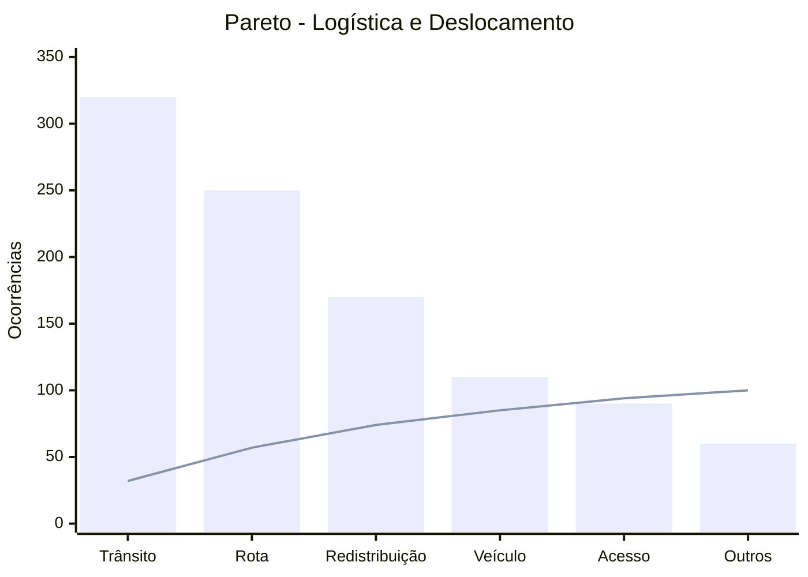

# Pareto - Logística e Deslocamento

```mermaid
xychart-beta
    title "Pareto - Logística e Deslocamento"
    x-axis ["Trânsito", "Rota", "Redistribuição", "Veículo", "Acesso", "Outros"]
    y-axis "Ocorrências" 0 --> 350
    bar [320, 250, 170, 110, 90, 60]
    line [32, 57, 74, 85, 94, 100]
```