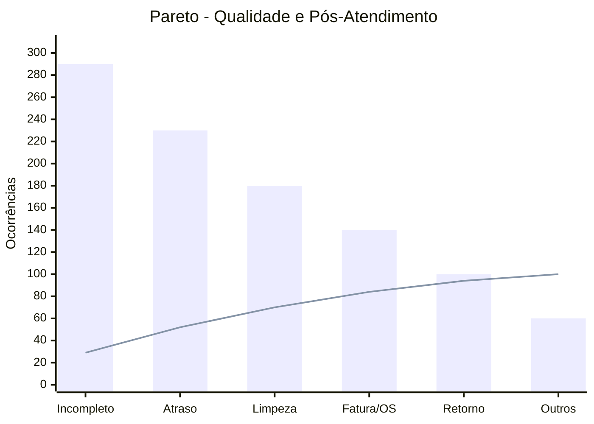

# Pareto - Qualidade e Pós-Atendimento

```mermaid
xychart-beta
    title "Pareto - Qualidade e Pós-Atendimento"
    x-axis ["Incompleto", "Atraso", "Limpeza", "Fatura/OS", "Retorno", "Outros"]
    y-axis "Ocorrências" 0 --> 310
    bar [290, 230, 180, 140, 100, 60]
    line [29, 52, 70, 84, 94, 100]
```