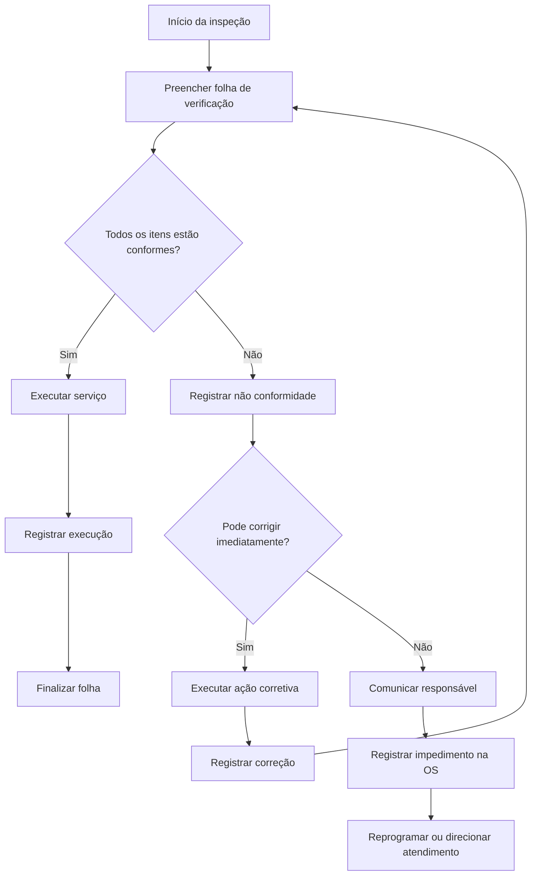
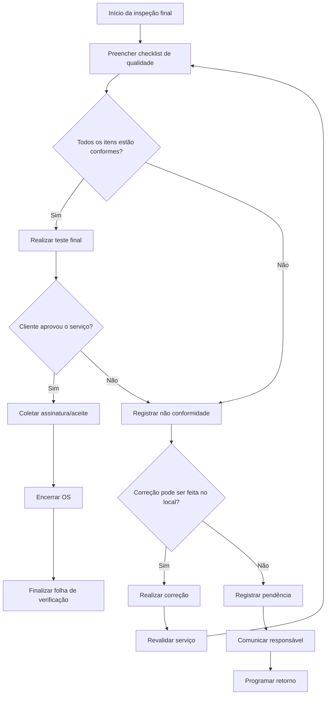
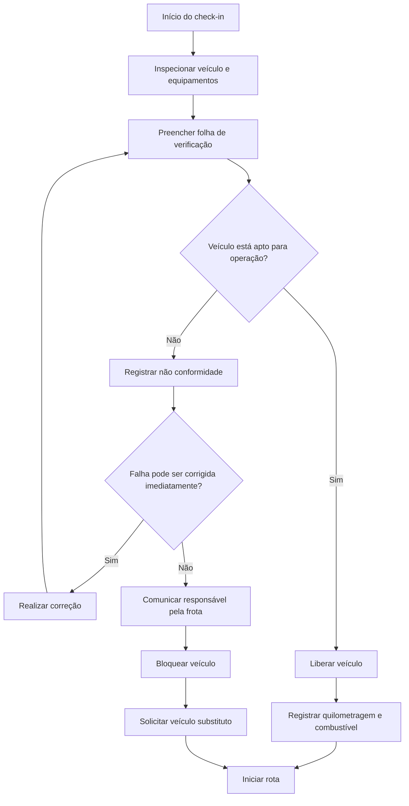
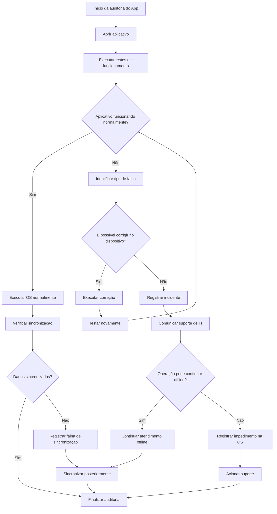
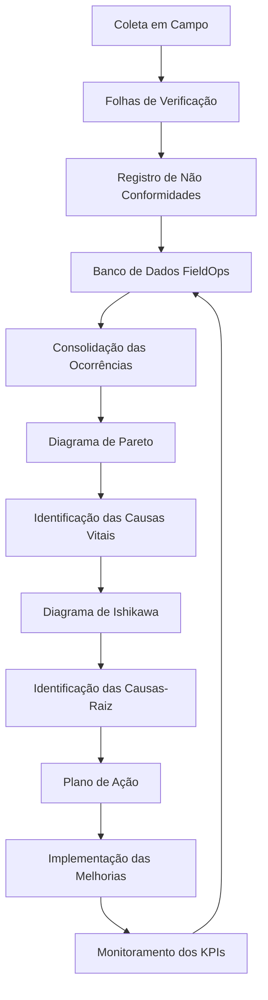

# Folhas de Verificação — FieldOps

## Gestão de Serviços e Operações de Campo

### Objetivo

As Folhas de Verificação têm como objetivo padronizar a coleta de dados das operações de campo do projeto **FieldOps**, permitindo registrar falhas e não conformidades durante a execução dos serviços.

Os dados coletados poderão posteriormente alimentar análises como:

**Folha de Verificação → Pareto → Ishikawa → Plano de Ação → Monitoramento**

---

# 1. Folha de Verificação — Inspeção Prévia e Execução do Serviço em Campo

### Objetivo

Verificar se o técnico possui todas as condições necessárias para executar a Ordem de Serviço corretamente.

| Item de Verificação | Status (Conforme / Não Conforme / N/A) | Frequência de Falhas (Contagem) | Ação Corretiva Imediata |
|---|---|---:|---|
| Peças necessárias disponíveis | Conforme / Não Conforme / N/A | 0 | Separar ou solicitar peças |
| Ferramentas adequadas disponíveis | Conforme / Não Conforme / N/A | 0 | Providenciar ferramenta adequada |
| Diagnóstico prévio disponível | Conforme / Não Conforme / N/A | 0 | Solicitar informações adicionais |
| Ordem de serviço corretamente preenchida | Conforme / Não Conforme / N/A | 0 | Corrigir informações da OS |
| Autorização do cliente confirmada | Conforme / Não Conforme / N/A | 0 | Confirmar autorização |
| Endereço e localização conferidos | Conforme / Não Conforme / N/A | 0 | Atualizar endereço/localização |
| EPIs necessários disponíveis | Conforme / Não Conforme / N/A | 0 | Providenciar EPI |
| Condições para execução verificadas | Conforme / Não Conforme / N/A | 0 | Comunicar impedimento |
| Serviço executado conforme procedimento | Conforme / Não Conforme / N/A | 0 | Corrigir execução |
| Evidências do serviço registradas | Conforme / Não Conforme / N/A | 0 | Registrar fotos/evidências |

### Fluxo de decisão

---

# 2. Folha de Verificação — Controle de Qualidade e Pós-Atendimento

### Objetivo

Garantir que o serviço esteja completamente concluído antes do encerramento da Ordem de Serviço, reduzindo retrabalho, reclamações e chamados de garantia.

| Item de Verificação | Status (Conforme / Não Conforme / N/A) | Frequência de Falhas (Contagem) | Ação Corretiva Imediata |
|---|---|---:|---|
| Serviço executado integralmente | Conforme / Não Conforme / N/A | 0 | Realizar etapa pendente |
| Equipamento/serviço funcionando corretamente | Conforme / Não Conforme / N/A | 0 | Realizar teste ou correção |
| Teste final realizado | Conforme / Não Conforme / N/A | 0 | Repetir teste |
| Local de atendimento limpo | Conforme / Não Conforme / N/A | 0 | Realizar limpeza |
| Materiais e ferramentas recolhidos | Conforme / Não Conforme / N/A | 0 | Recolher materiais |
| Fotos do serviço concluído anexadas | Conforme / Não Conforme / N/A | 0 | Registrar novas fotos |
| Assinatura/aceite do cliente coletado | Conforme / Não Conforme / N/A | 0 | Solicitar aceite |
| Observações finais registradas | Conforme / Não Conforme / N/A | 0 | Complementar informações |
| OS encerrada corretamente | Conforme / Não Conforme / N/A | 0 | Corrigir dados da OS |
| Cliente informado sobre conclusão | Conforme / Não Conforme / N/A | 0 | Realizar comunicação |

### Fluxo de decisão

---

# 3. Folha de Verificação — Check-in Logístico e Inspeção do Veículo/Frota

### Objetivo

Identificar problemas no veículo, equipamentos e recursos antes do início das rotas, reduzindo atrasos, paradas e custos operacionais.

| Item de Verificação | Status (Conforme / Não Conforme / N/A) | Frequência de Falhas (Contagem) | Ação Corretiva Imediata |
|---|---|---:|---|
| Quilometragem registrada | Conforme / Não Conforme / N/A | 0 | Registrar quilometragem atual |
| Nível de combustível adequado | Conforme / Não Conforme / N/A | 0 | Abastecer veículo |
| Pneus em condições adequadas | Conforme / Não Conforme / N/A | 0 | Solicitar inspeção/manutenção |
| Freios funcionando corretamente | Conforme / Não Conforme / N/A | 0 | Retirar veículo de operação |
| Luzes e sinalização funcionando | Conforme / Não Conforme / N/A | 0 | Corrigir ou solicitar manutenção |
| EPIs disponíveis no veículo | Conforme / Não Conforme / N/A | 0 | Repor EPIs |
| Ferramentas e equipamentos disponíveis | Conforme / Não Conforme / N/A | 0 | Repor equipamentos |
| Documentação do veículo válida | Conforme / Não Conforme / N/A | 0 | Regularizar documentação |
| Veículo limpo e organizado | Conforme / Não Conforme / N/A | 0 | Realizar limpeza/organização |
| Avarias externas registradas | Conforme / Não Conforme / N/A | 0 | Registrar ocorrência |
| Equipamentos de emergência disponíveis | Conforme / Não Conforme / N/A | 0 | Providenciar equipamento |

### Fluxo de decisão

---

# 4. Folha de Verificação — Auditoria de Funcionamento do App Mobile

### Objetivo

Monitorar a confiabilidade do aplicativo utilizado pelos técnicos durante os atendimentos, principalmente em situações de operação offline.

| Item de Verificação | Status (Conforme / Não Conforme / N/A) | Frequência de Falhas (Contagem) | Ação Corretiva Imediata |
|---|---|---:|---|
| Login realizado normalmente | Conforme / Não Conforme / N/A | 0 | Reiniciar app ou validar acesso |
| OS carregada corretamente | Conforme / Não Conforme / N/A | 0 | Atualizar dados da OS |
| Modo offline funcionando | Conforme / Não Conforme / N/A | 0 | Registrar operação localmente |
| Dados salvos durante modo offline | Conforme / Não Conforme / N/A | 0 | Salvar novamente |
| Sincronização realizada após conexão | Conforme / Não Conforme / N/A | 0 | Executar nova sincronização |
| GPS apresentou localização correta | Conforme / Não Conforme / N/A | 0 | Reativar localização |
| Fotos anexadas corretamente | Conforme / Não Conforme / N/A | 0 | Repetir upload |
| Aplicativo apresentou travamento | Conforme / Não Conforme / N/A | 0 | Reiniciar aplicativo |
| Consumo de bateria adequado | Conforme / Não Conforme / N/A | 0 | Ativar economia de bateria |
| Notificações recebidas corretamente | Conforme / Não Conforme / N/A | 0 | Verificar permissões |
| OS encerrada e sincronizada | Conforme / Não Conforme / N/A | 0 | Reprocessar sincronização |

### Fluxo de decisão

---

# Integração das Folhas com a Análise de Dados

As quatro folhas devem gerar dados estruturados para permitir a análise posterior das ocorrências.

## Fluxo de coleta e análise

## Indicadores que podem ser gerados

| Indicador | Fonte | Objetivo |
|---|---|---|
| Taxa de não conformidade | Folhas de verificação | Medir falhas operacionais |
| Falhas por Ordem de Serviço | OS / Checklist | Identificar serviços problemáticos |
| First Time Fix Rate | Execução em campo | Medir resolução na primeira visita |
| Tempo médio de deslocamento | Logística | Avaliar eficiência das rotas |
| Taxa de falha de sincronização | App Mobile | Medir confiabilidade do aplicativo |
| Taxa de retrabalho | Qualidade | Identificar serviços que precisam ser refeitos |
| NPS | Pós-atendimento | Avaliar satisfação do cliente |
| Chamados de garantia | Pós-atendimento | Monitorar falhas após conclusão |
| Disponibilidade da frota | Logística | Avaliar impacto de veículos indisponíveis |

## Ciclo de Melhoria Contínua

**Coletar → Medir → Analisar → Identificar causa → Corrigir → Monitorar → Melhorar**

Esse ciclo permite que o FieldOps transforme as ocorrências registradas pelos técnicos em **dados para tomada de decisão e melhoria contínua dos processos de campo**.